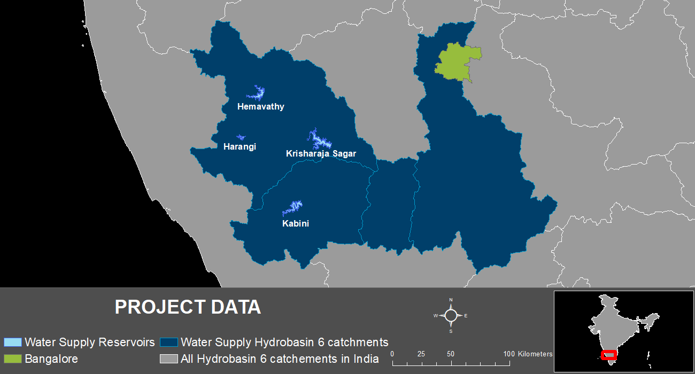

# Wave2WebHack

"Sustainable Innovation Requires Actionable Insights" our team believes in

Artificial intelligence or machine-learning-based forecasting of reservoir water availability based on historical water availability, hydro-meteorological data, and water demand. Data visualizations and dissemination of forecasted water availability and other important hydro-meteorological datasets to help inform decision-making and shifting towards water-sensitive practices.

Performance metrics for Modelling and Prediction  for the below Datasets considered are 

Monitoring water levels can have numerous environmental benefits and is a popular measurement for a number of different industries and organisations. Below we will discuss some of the common applications water level monitoring devices, as well as some of the valuable insights that recording this can reveal.
Remote water level monitoring

Whereas water level monitoring used to be done by manually, with engineers sent to record levels of water on a fixed, often monthly basis, the ever-increasing improvements to technology means that water level monitoring can now be done remotely.

Telemetric devices allow for water levels to be recorded much more regularly. This data can then be sent to other devices over great distances which allows for greater response capabilities and ease of use.

In addition, remote water level monitoring also carry a number of other benefits including improved accuracy and reduced risk of human errors.
Common applications for water level monitoring

As well as time-saving benefits, water level monitoring can have a wide variety of environmental benefits, such as improved visibility on potential flood situations. By utilising water level monitoring systems, it is much easier to rapidly deploy countermeasures in the event that levels become too high or low.

Water level loggers feature highly sensitive pressure sensors which can detect the smallest of changes to water level and can send alerts to preferred contacts alerting them to the situation.

This benefit means that water level monitoring is commonly used in some of the following applications:

    Flood monitoring
    River level monitoring
    Wetland studies
    Tidal studies
    Groundwater monitoring
    Surface water monitoring

**Daily reservoir water data for the 4  reservoirs Kabini,Harangi,Hemavathi,KSR

**Key contextual shapefiles

**A link to Aqueduct water risk indicators

Groundwater Research paper Information 
Groundwater Level Dynamics in Bengaluru City, India
Groundwater- important source of drinking water
meets nearly 85% of rural domestic water needs and 50% of urban water needs 

Factors affecting increase groundwater system dependence:
no accelerated growth
increasing per capita water use
poor reliability of imported surface water from distant sources
Urbanization is affecting ground water availability
in many dense cities in arid areas, water supply imports are greater than annual rainfall
In this paper, we focus on understanding the groundwater patterns and dynamics in Bengaluru
 The area of city limits, has also grown substantially—ten times from a mere 75 km2 in 1901
In Bangalore-groundwater is heavily used
CGWB has estimated that groundwater is more than 100% developed in Bengaluru, which means that abstraction (pumping) is more than recharge to the aquifer
Objectives of this paper:
 collecting a time series of groundwater table depths and using the data to study the spatial patterns in groundwater levels;
 estimating net groundwater storage changes Sustainability 2018, 10, 26 3 of 22 during drought year 2016 and during extreme rainfall periods
estimating the rainfall recharge factor net groundwater flux. 
Water needs of the city is majorly from----- Cauvery waters and groundwater.
Surface water imported from the Cauvery River, currently at close to 1400 million liters per day is approximately 75% of the average rainfall over the city,
although surface water supply has increased over time, it has been unable to catch up with the rapid growth and expansion of the city
So result---groundwater gives the largest proportion
Groundwater levels (GWL) were measured using a monitoring network of 158 wells in an area of 700 km
